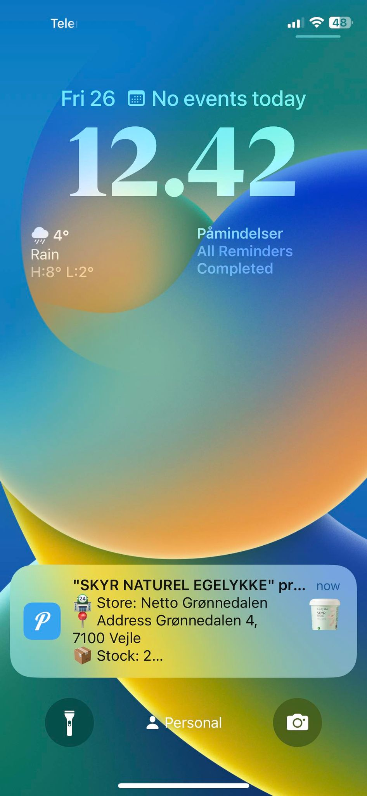
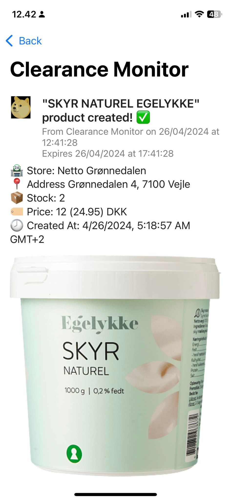

Salling Clearance Monitor is a script that observes local discounted items near any Bilka, Foetes or Netto stores near you and notifies you via your phone through Push Notifications (made possible by Pushover). Notifications will be sent when the available amount of the specified item(s) you're interested in rises from 0

## Disclaimer

This Project is not affiliated, associated, authorized, endorsed by, or in any way officially connected with Salling Group, or any of its subsidiaries or its affiliates.

## Installation

You can install this tool on any computer. For 24/7 notifications I recommended running this script on  VPS via providers like Digitalocean.

1. Install dependencies using [pnpm](https://pnpm.io/installation):
   ```
   pnpm install
   ```
2. Copy .env.example to .env and update the variables. Make sure to follow the comments inside the .env file else the script wont work properly!
   ```
   cp .env.example .env
   ```
3. Build the monitor script
   ```
   pnpm run build
   ```
4. Start the monitor script
   ```
   pnpm run start
   ```

## Notification example

Layout of the notification messages through Pushover




